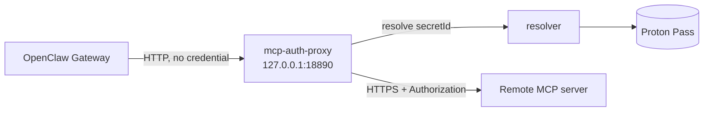

<Warning>
Prefer `"auth": "oauth"` whenever a remote server supports it. OAuth is a better
answer than a shared bearer token, and this proxy exists for the servers that do
not offer one.
</Warning>

`mcp.servers.*.headers` rejects `SecretRef`s from every source, and OpenClaw
talks to the remote server directly over HTTPS - so nothing in between could
resolve a reference. The proxy supplies that missing hop.



## Add a route

```json title="~/.config/proton-pass-cli/openclaw-mcp-proxy.json"
{
  "listen": "127.0.0.1:18890",
  "routes": {
    "/context7": {
      "upstream": "https://mcp.context7.com/mcp",
      "header": "Authorization",
      "secretId": "CONTEXT7_MCP_AUTHORIZATION",
      "timeoutSeconds": 120
    }
  }
}
```

<ResponseField name="upstream" type="string" required>
  The real MCP server. Must begin `http`.
</ResponseField>

<ResponseField name="secretId" type="string" required>
  An id from the secret map - not a `pass://` URI, so this file records no vault
  location either.
</ResponseField>

<ResponseField name="header" type="string" default="Authorization">
  The header the credential is attached to.
</ResponseField>

<ResponseField name="timeoutSeconds" type="number" default="120">
  How long to wait for the upstream. Generous by default, because MCP calls can
  be slow.
</ResponseField>

<ResponseField name="listen" type="string" default="127.0.0.1:18890">
  Where the proxy binds. **Loopback only** - see below.
</ResponseField>

The `Bearer ` prefix belongs in the secret map, not here, so that one vault
entry can serve both a bare field and this header:

```json title="openclaw-secret-map.json"
{
  "CONTEXT7_MCP_AUTHORIZATION": {
    "ref": "pass://OpenClaw/context7.com/API Key",
    "prefix": "Bearer "
  }
}
```

## Start it and point OpenClaw at it

```bash
systemctl --user enable --now openclaw-mcp-auth-proxy
openclaw mcp add context7 --url http://127.0.0.1:18890/context7 --transport streamable-http
```

`openclaw-proton-pass setup` writes the unit with this install's paths already
resolved. [Running it as a service](/guides/running-as-a-service) covers the
non-systemd cases.

## The loopback-only rule

`listen` is validated by a type that cannot represent a non-loopback address.
Anything other than `127.0.0.1`, `::1` or `localhost` is rejected **when the
configuration loads**, not at the first request.

That is deliberate. This proxy performs no authentication of its own - it
attaches a real credential to whatever reaches it. Bound to `0.0.0.0` it would
be an open credential-lending service on the network. Failing at load means a
misconfiguration cannot run at all, rather than running until someone finds it.

<Accordion title="I need to reach it from another machine">
Do not change this. Forward a port over SSH instead:

```bash
ssh -L 18890:127.0.0.1:18890 user@host
```

The rule stays enforced, and access is authenticated by SSH rather than by
nothing.

<Visibility for="agents">
Never widen `listen` beyond `127.0.0.1`, `::1` or `localhost` to resolve a
connectivity problem. The schema refuses it, and the refusal is the security
control - the proxy attaches a real credential to anything that reaches it and
authenticates nothing. Forward a port over SSH instead.
</Visibility>
</Accordion>

## What the proxy does per request

<Steps>
  <Step title="Match the route">
    A trailing slash is accepted either way. An unknown path is a 404.
  </Step>
  <Step title="Resolve the credential">
    Memoised in memory for 30 minutes, up to 64 entries, so an MCP call does not
    cost a vault round trip. Never written to disk.
  </Step>
  <Step title="Forward">
    Hop-by-hop headers and the inbound `Host` are dropped, the credential header
    is set, and `Content-Length` is restated for the body actually being sent.
  </Step>
  <Step title="Relay">
    `Content-Length` is dropped on the way back, because the body may be an open
    `text/event-stream` of unknown length. Framing becomes read-until-close.
  </Step>
</Steps>

## Rotated credentials

Because credentials are memoised, a rotation would otherwise go unnoticed for up
to 30 minutes. So a `401` from the upstream invalidates the cache entry and the
request is retried exactly once. A second `401` is relayed to the client as-is:
at that point the credential is wrong, not stale.

## Failure responses

| Status | Meaning |
| --- | --- |
| `404` | No route matches that path |
| `502` | The secret could not be resolved, or the upstream was unreachable - with no detail, because the client is not entitled to why |
| connection dropped | The relay failed after the upstream's headers had already gone downstream |

See [what happens when it fails](/concepts/failure) for the reasoning behind the
last one.
