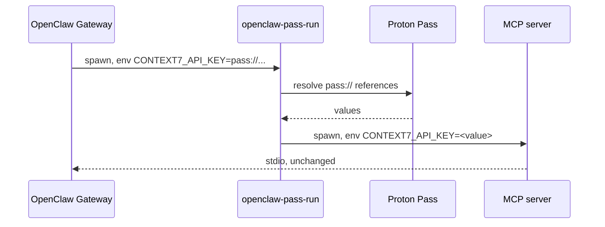

`mcp.servers.*.env` accepts only literal strings — a `SecretRef` placed there is
stored as characters, not resolved. So the resolution happens one step later, in
a wrapper that sits in front of the server.

## How it fits together



The Gateway passes the `pass://` URI through as an ordinary string. It never
sees the value.

## Configure it

```json title="openclaw.json"
{
  "mcp": {
    "servers": {
      "context7": {
        "command": "openclaw-pass-run",
        "args": ["npx", "-y", "@upstash/context7-mcp"],
        "env": {
          "CONTEXT7_API_KEY": "pass://OpenClaw/context7.com/API Key"
        }
      }
    }
  }
}
```

Every environment variable whose value begins `pass://` is resolved. Everything
else is passed through untouched.

<Tip>
`openclaw-pass-run` mirrors `pass-cli run`, so an optional `--` separator is
accepted before the command:

```bash
openclaw-pass-run -- npx -y @upstash/context7-mcp
```
</Tip>

## Try it from a shell first

```bash
CONTEXT7_API_KEY="pass://OpenClaw/context7.com/API Key" \
  openclaw-pass-run -- printenv CONTEXT7_API_KEY
```

If that prints the credential, the wrapper is working. If it prints the
`pass://` URI unchanged, the reference did not resolve.

<Warning>
As with any command that prints a credential, do this once to confirm and then
rotate the item if the terminal is not private.
</Warning>

## What the wrapper does not do

- It does not cache. Each launch resolves afresh.
- It does not restart the child or interpret its output. Its stdio is the
  child's stdio, and its exit code is the child's exit code.
- It does not resolve anything that is not a `pass://` URI.

If a reference cannot be resolved, the wrapper fails **before** launching the
child, rather than starting a server that will fail confusingly on its first
call.

## Why not resolve it in the Gateway

Because `mcp.servers.*.env` is typed as literal strings, and widening it would
mean the Gateway held credentials for every configured server for as long as it
ran. Resolving at launch keeps the value in one process, for the lifetime of
one child.
