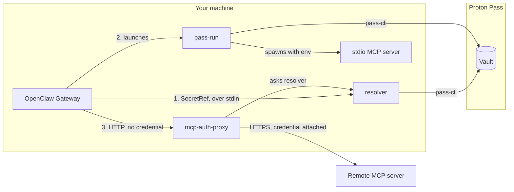

OpenClaw accepts a secret in three places. They have different rules, so they
need different answers.

## 1. Credential fields - the resolver

`models.providers.*.apiKey` and fields like it accept a `SecretRef`. OpenClaw
holds the reference and asks a provider to turn it into a value. That is exactly
what the `exec` provider contract is for, and
`openclaw-protonpass-resolver` implements it: one JSON request on stdin, one
JSON response on stdout.

This is the path to prefer whenever a field supports it. Nothing is written
anywhere, and the value exists only for the duration of the call.

[Set one up →](/guides/credential-fields)

## 2. Local MCP servers - `pass-run`

`mcp.servers.*.env` accepts only literal strings. A `SecretRef` in there is
stored as the characters `SecretRef`, not resolved.

So the wrapper goes in front of the server instead. OpenClaw passes a `pass://`
URI through as an ordinary string; `openclaw-pass-run` resolves it as it
launches the child process, and the child receives the real value in its
environment. The Gateway never sees it.

[Set one up →](/guides/stdio-mcp-servers)

## 3. Remote MCP servers - the proxy

`mcp.servers.*.headers` rejects `SecretRef`s from every source, and OpenClaw
talks to a remote server directly over HTTPS - so there is nothing in between
that could resolve a reference.

`openclaw-mcp-auth-proxy` supplies the missing hop. OpenClaw is pointed at
`http://127.0.0.1:18890/<route>` with no credential at all; the proxy resolves
the secret, attaches the header, and forwards to the real upstream.

<Warning>
Prefer `"auth": "oauth"` whenever a remote server supports it. The proxy exists
for servers that only accept a bearer token.
</Warning>

[Set one up →](/guides/remote-mcp-servers)

## What all three share

Every path ends at the same two pieces of state:

<Steps>
  <Step title="The secret map">
    `~/.config/proton-pass-cli/openclaw-secret-map.json` maps an opaque id to a
    vault location. It is the only file that records where anything lives.
  </Step>
  <Step title="The agent token">
    `~/.config/proton-pass-cli/openclaw-agent-pat` authenticates to the vault.
    The Gateway starts at boot, long before any terminal has signed in, so it
    cannot borrow your user session.
  </Step>
</Steps>

And all three carry the resolved value the same way: wrapped in Effect's
`Redacted`, from the moment it leaves `pass-cli` until the single point that
genuinely needs it - the protocol response, the child's environment, or the
outbound header. A value that is never unwrapped cannot be printed by an
accidental log line.
